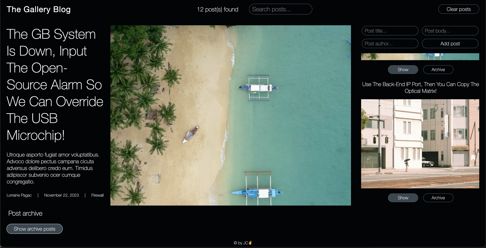

# The Gallery Blog

The Gallery Blog is a web application built with React, to showcase the use of Context API.
With a modern, stylish and intuitive design, it's ideal for visual storytelling and content sharing.

https://the-gallery-blog.netlify.app/

## Features

- **Show, Archive, Submit Pictures:**: Engage with posts and different pictures and interactions.

## Technical Highlights
- **State Management:** By using React's Context API, The Gallery Blog centralizes its state management, offering a efficient way to handle cross-component state without the complexity of prop drilling.
